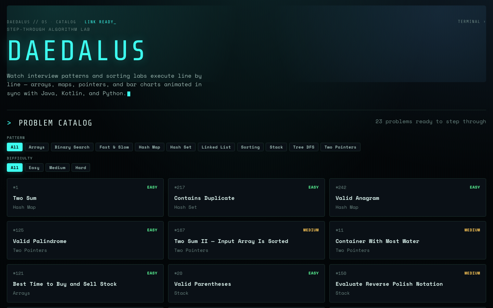
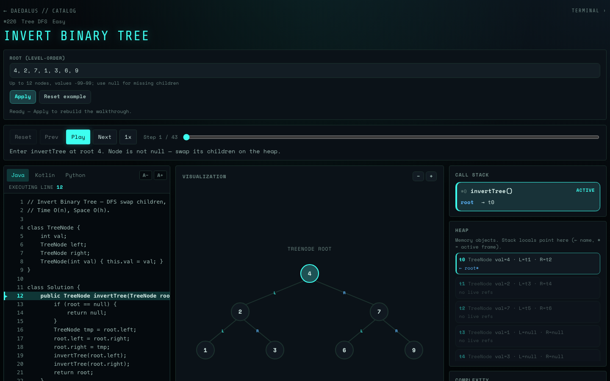
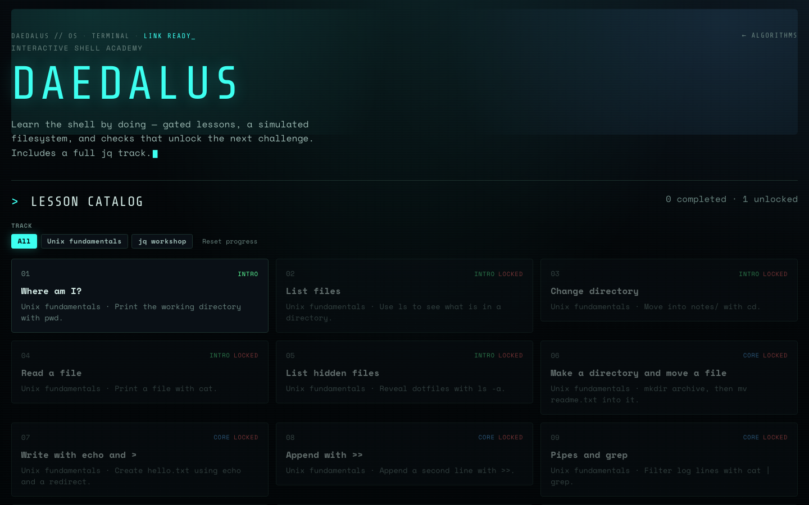
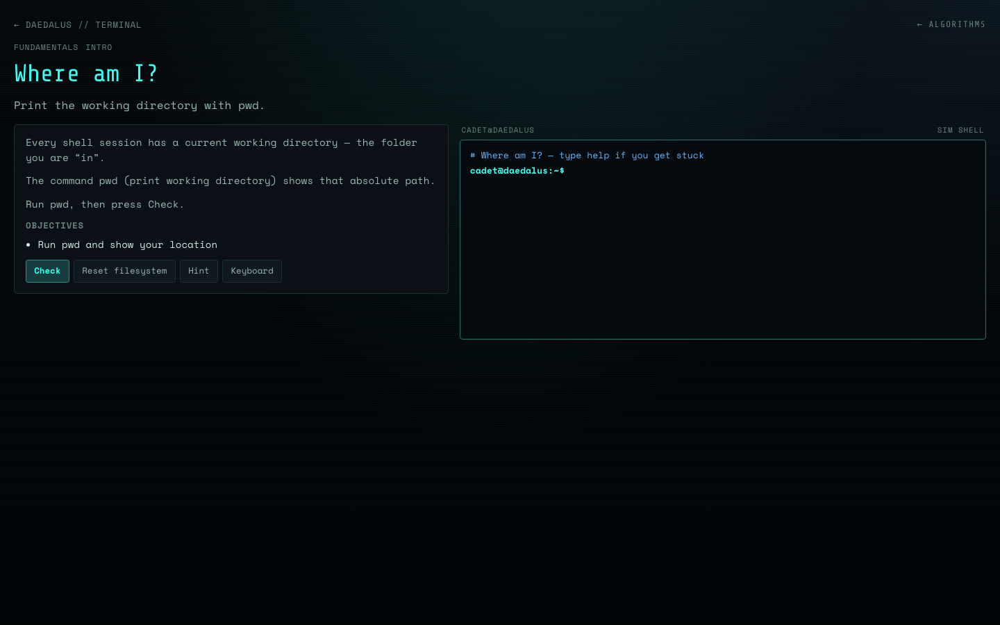

# Daedalus

In the old stories, Daedalus was the craftsman who built the Labyrinth: clever enough to design a maze you could get lost in, and careful enough to leave himself a way through it. That is roughly the spirit of this project. Interview algorithms can feel like a maze of pointers, stacks, and recursive returns. Daedalus is here so you can walk the path with the lights on.

**Daedalus is a growing learning platform:** a browser lab for stepping through coding-interview algorithms, a Terminal Academy for shell basics, and System Design labs with live sims. Curated execution traces, animated structures, and the same idea in Java, Kotlin, and Python side by side. The catalog and curriculum expand as people solve new problems and teach them well.

**Repo:** https://github.com/ashczar77/daedalus



## What you can do here

**Algorithm lab.** Open a problem from the catalog, hit play or step one beat at a time, and watch the heap and call stack move with the narrative. Arrays, maps, stacks, queues, heaps, linked lists, trees, and sorting bars all have their own drawings. Custom inputs are supported on the packs that ship generators, so you are not stuck with a single demo case.



**Terminal Academy.** Terminal has gated shell lessons on a simulated filesystem: fundamentals, a mastery track with reinforcement drills, and a jq workshop. Completing lessons earns XP and ranks. Progress stays in local storage on your machine.





**System Design.** Open `/system-design` for concept labs: short teaching beats, then a live simulation. Paths include Load Balancing (round robin, weighted round robin, least connections, consistent hashing) and Caching (cache-aside, read-through, write-through, write-behind, plus LRU, LFU, FIFO, and TTL). Labs are listed in a suggested order and all start unlocked.

## Contributing

Engineers are welcome, especially if you care about clear teaching, not just "another LeetCode dump." Good PRs make a pattern easier to *see*.

**High-impact ways to help**

| Contribution | Why it matters |
| --- | --- |
| New algorithm pack | Grow the catalog with a real walkthrough (Java / Kotlin / Python + stepped viz) |
| Stronger visualizations | Sharper structure drawings, better focus beats, clearer unlink / heap / tree cues |
| Terminal Academy lessons | More shell drills, better checks, new tracks |
| System Design labs | New paths/sims under `src/system-design/` (teaching beats + live viz) |
| Engine / UX polish | Playback, inputs, accessibility, catalog ergonomics |
| Tests & docs | Keep generators honest; leave the next author a map |

**Adding a problem pack (short path)**

1. Solutions under a folder like `algorithms/0215-kth-largest-element-in-an-array/` (`Solution.java`, `Solution.kt`, `solution.py`). Use the LeetCode number plus a short kebab-case name.
2. Pack module in `src/problems/` with `generateSteps`, metadata, and a `defineInput` spec.
3. Register it in `src/problems/registry.ts`.
4. Reuse an existing visualizer when you can; add a scene kind only when the structure is new.
5. Run `npm test` and `npm run build`. Trace validation and the suite gate merges.

Authoring checklist (inputs, fixtures, limits): [`docs/authoring-packs.md`](docs/authoring-packs.md). Mirror a recent pack (heap, queue, linked list) if you want a template.

**PR tips**

- Prefer one pack or one focused improvement per PR.
- Teach the invariant in the narrative: "what just happened" and "why it is safe."
- Keep demos small enough to step through without drowning the learner.
- Follow the look and writing style of nearby packs. Prefer clear teaching over fancy UI.

Open an issue if you want to align on a pattern or a new structure before coding. Questions and draft PRs are fine. This platform grows by people teaching what they just learned.

## Develop

```bash
npm install
npm run dev
```

Production build (includes trace validation):

```bash
npm run build
```

Other scripts:

```bash
npm test                  # unit + integration tests (Vitest)
npm run validate:traces   # check curated traces against sources
npm run lint
npm run preview           # serve the production build locally
```

`npm run build` runs trace validation and the test suite before compiling.

## Project layout (rough map)

| Path | What lives there |
| --- | --- |
| `algorithms/` | Java / Kotlin / Python solutions the player highlights |
| `src/problems/` | Packs: steps or generators, metadata, registry |
| `src/engine/` | Playback, step normalization, shared input parsing |
| `src/visualizers/` | Structure drawings (arrays, trees, heaps, lists, etc.) |
| `src/academy/` | Terminal Academy lessons, VFS shell, checkers |
| `src/system-design/` | System Design paths, labs, sims, and viz |
| `src/pages/` | Catalog, problem player, academy / system-design pages |
| `docs/authoring-packs.md` | Checklist for adding problem packs |
| `docs/reviews/` | Local phase write-ups only (gitignored, not on GitHub) |
| `docs/media/` | Screenshots used in this README |

## Notes and limits

- Benchmark numbers on the player are placeholders for teaching the UI story, not live timings from your machine.
- The academy shell is simulated on purpose. It teaches a useful subset of commands. It is not a full Linux userspace and it will not run arbitrary programs.
- Trace validation runs as part of `npm run build`. If a pack's story and `codeFocus` drift apart, the build should complain.

## License / status

Open learning lab under active development. Clone it, improve a viz, add the problem you just mastered, and send a PR.
